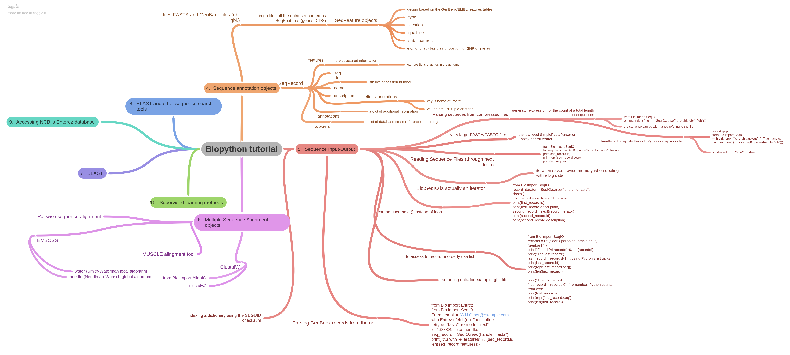

# Bioinformatics with python

- Biopython
- Scikit-Bio
- Biotite
---
What is BioPython
<br/>
for installing biopython:<br/>
```pip install biopython```
or <br/>
```conda install -c conda-forge biopython```<br/><br/>
Applications:
- For sequence analysis (DNA,RNA)
- To do transcription and translation of DNA (Protein Synthesis)
- Querying and Access Bioinformatic Databases
  - Entrez, BLAST, GenBank,etc
- 3D Structure analysis

Questions:
- How to create a sequence?
- Protein Synthesis (Transcription,Translation)
- Find GC content
- Molecular weights of a protein or DNA
- Convert protein sequence from one-letter to three-letter code and vice versa
- Find patterns
- How to find the Frequency of Nucleotide, Amino Acids,etc
- Sequence Alignment
- Similarity and homology
<br/>
- Features of BioPython

